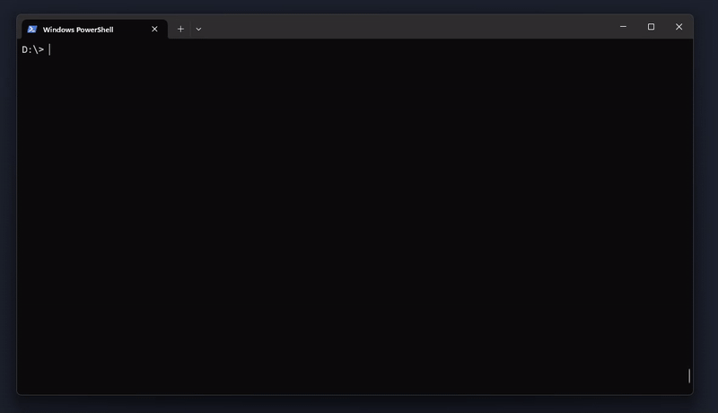
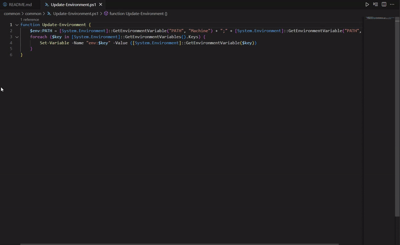

# PastePilot
A Clipboard AI Agent for Windows.

Connect any OpenAi conform API to your Clipboard (local or remote).





## How does it work?
1. Copy any text anywhere. 
    * If the text contains `|||`
        * The clipboard will be send to the chosen AI-API-Endpoint and a popup with the `<response>` will show up.
        * The clipboard will also be replaced with the `<response>`.

## Try it out
To check whether everything works copy the following text:
```powershell
||| Hi, tell me a funny joke :-).
```

## Installation
0. checkout (download) this git-repository
1. copy the `.env`-file to `.env.prod` and fill in your `AI_API_KEY`
2. Open a powershell (`>= v5.1`) and execute `start.ps1`

Your PastePilot is up and running as long as the powershell session is not closed :-)

## Privacy
* Your API-Key is only used to invoke the API and is not shared with anybody else.
* No third party modules are used. There are no additional dependencies installed.

